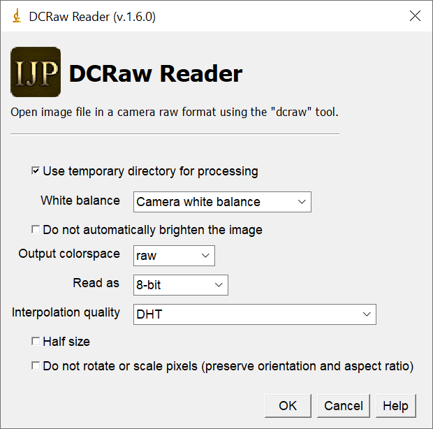

ijp-dcraw
=========

[](https://github.com/ij-plugins/ijp-dcraw/actions/workflows/scala.yml)

`ijp-dcraw` provides ImageJ plugin "DCRaw Reader" to open raw images from digital cameras. Originally the backend was
provided by [dcraw] tool. New versions will use [LibRaw]/`dcraw_emu` tool. The hundreds of supported cameras ate listed
on [LibRaw Supported Cameras] page.



The "DCRaw Reader" plugin requires the DCRAW binary. `ijp-dcraw` distribution, available from [Releases] page, provides
binaries for Windows and Linux. Binaries for other system can be added manually.

By default, the "DCRaw Reader" plugin looks for the DCRAW binary in subdirectory `dcraw` of ImageJ plugins folder.
Alternative location can be specified by adding property `.dcrawExecutable.path` to ImageJ properties
file `IJ_Props.txt`. Example line that should be added to `IJ_Props.txt`

```
.dcrawExecutable.path=C:/apps/bin/dcraw.exe
```

Note period at the beginning of property name, it is required by ImageJ.

Related Plugins
---------------

* [ijp-color] Contains plugin [IJP Color Calibrator] that can be used to color calibrated raw images. For instance, it works well with "16-bit linear" images.
* [ijp-DeBayer2SX] an alternative way to demosaic raw images

Tips and Tricks
---------------

### See Backend Options Passed to `dcraw`

If you wander what is going on behind the scenes, how `dcraw` executable is used, you can see the exact command line the
ij-dcraw is executing by turning on Debug mode. Select in ImageJ menu: "Edit" > "Options" > "Misc" and select "Debug
Mode". Now open an image using DCRaw Reader and watch the Log window, it will show the command line with the options
used and the output log generated by dcraw.

### Sample ImageJ macro for batch image conversion

```javascript
//Get File Directory and file names
dirSrc = getDirectory("Select Input Directory");
dirDest = getDirectory("Select Output Directory");
fileList = getFileList(dirSrc);
caption = "dcraw batch converter";

print(caption + " - Starting");
print("Reading from : " + dirSrc);
print("Writing to   : " + dirDest);

// Create output directory
File.makeDirectory(dirDest);

setBatchMode(true);
fileNumber = 0;
while (fileNumber < fileList.length) {
    id = fileList[fileNumber++];

    print(toString(fileNumber) + "/" + toString(fileList.length) + ": " + id);

    // Read input image
    run("DCRaw Reader...",
        "open=" + dirSrc + id + " " +
        "use_temporary_directory " +
        "white_balance=[Camera white balance] " +
        //            "do_not_automatically_brighten " +
        "output_colorspace=[raw] " +
        //            "document_mode " +
        //            "document_mode_without_scaling " +
        "read_as=[8-bit] " +
        "interpolation=[High-speed, low-quality bilinear] " +
        //            "half_size " +
        //            "do_not_rotate " +
        //            "show_metadata" +
        "");
    idSrc = getImageID();

    // Save result
    saveAs("Tiff", dirDest + id);

    // Cleanup
    if (isOpen(idSrc)) {
        selectImage(idSrc);
        close();
    }
}
print(caption + " - Completed");
```

### Using ij-dcraw directly from Java

```java
import java.io.File;

import ij_plugins.dcraw.DCRawReader;
import ij.IJ;
import ij.ImagePlus;

class Example {
   public static void main(String[] args) {
      // Input file
      final File inFile = new File("test/data/IMG_5604.CR2");

      // dcraw wrapper
      final DCRawReader dcRawReader = new DCRawReader();

      // Listen to output messages
      dcRawReader.addLogListener(
              m -> System.out.println("message = " + m));

      // Execute dcraw
      dcRawReader.executeCommand(new String[]{
              "-v", // Print verbose messages
              "-w", // Use camera white balance, if possible
              "-T", // Write TIFF instead of PPM
              "-j", // Don't stretch or rotate raw pixels
              "-W", // Don't automatically brighten the image
              inFile.getAbsolutePath()});

      // Cleanup
      dcRawReader.removeAllLogListeners();

      // Load converted file, it is the same location as original raw file but with extension '.tiff'
      final ImagePlus imp = IJ.openImage("test/data/IMG_5604.CR2.tiff");
   }
}

```

Release files
-------------

* `ij-dcraw_bin_1.5.0.r*.zip` - only ij-dcraw plugin, without dcraw executable.
* `ij-dcraw_native-bin-windows_1.5.0.r*.zip` - ij-dcraw plugin with Windows dcraw executable.
* `ij-dcraw_native-bin-linux_1.5.0.r*.tar.gz` - ij-dcraw plugin with Linux binaries (Ubuntu x64).
* `ij-dcraw_src_1.5.0.r*.zip` - sources.

Installation
------------

1. Download `ij-dcraw_bin_*`
2. Unzip to ImageJ plugins directory. By default, the Reader looks for the dcraw binary in subdirectory dcraw of ImageJ
   plugins folder. An alternative location can be specified by adding property `.dcrawExecutable.path` to ImageJ
   properties file `IJ_Props.txt` located in ImageJ home directory. Here is an example:
   `.dcrawExecutable.path=/apps/dcraw/dcraw`
   Note period at the beginning of property name, it is required by ImageJ.
3. Restart ImageJ

The plugin installs under `Plugins` > `Input-Output` > `DCRaw Reader`.


Notes
-----

ijp-dcraw project was originally hosted on [SourceForge]. Releases 1.5 and older can be found [there][SourceForge].

[dcraw]: https://en.wikipedia.org/wiki/Dcraw

[LibRaw]: https://www.libraw.org/about

[LibRaw Supported Cameras]: https://www.libraw.org/supported-cameras

[Releases]: https://github.com/ij-plugins/ijp-dcraw/releases

[SourceForge]: http://ij-plugins.sourceforge.net/plugins/dcraw/index.html

[ijp-color]: https://github.com/ij-plugins/ijp-color
[ijp-DeBayer2SX]: https://github.com/ij-plugins/ijp-DeBayer2SX
[IJP Color Calibrator]: https://github.com/ij-plugins/ijp-color/wiki/Color-Calibrator